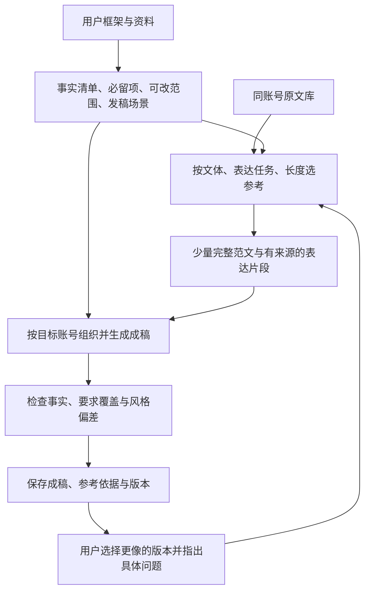

# 账号文案风格校准方案：以老青椒为首个试点

日期：2026-09-05。状态：诊断与实验设计，尚未实施生成链路改动或模型对照实验。

建议保留现有账号库、转写、支持文档、任务中心和草稿版本链，先改写作核心。首个目标限定为「老青椒的游戏介绍／活动推广类短口播」。在固定题目上确认效果后，再扩展至周报、热点评论和其他账号。

“完全符合账号风格”不能作为目前已经实现或能够保证的结果。初期验收采用用户盲选、事实与要求覆盖、人工修改负担三类证据。

## 已核实的问题

### 1. 原文选错了，比风格描述不够细更直接

`src/lib/ai.ts:239` 将账号写作样本数固定为 8；`resolveWriteStyleContext()`（约 3003 行）只接收账号引用与是否包含样本，没有接收本次题材、长度、框架或内容类型。`src/lib/storage.ts:2337` 取按热度排序的已转写视频前若干篇。

老青椒抖音库目前有 13 篇转写。写作选择的前 8 篇中，7 篇为《乐子周报》，另 1 篇为守望先锋转场快爆。周报完整转写约 3284–4490 字。更接近本次游戏介绍与推广任务的两篇未被选入：

| 热度排名 | 样本 | 原文长度 | 可借鉴的表达动作 |
| --- | --- | --- | --- |
| 9 | 永劫无间景区联动，视频 `7669313121198376436` | 764 字 | 先展示反常现象，制造好奇，再揭示游戏活动，解释规则，回到玩家整活 |
| 10 | 新游档期与遗忘之海，视频 `7634912073587182899` | 1239 字 | 先承认观众对常见设定的疲劳，再用具体机制说明差异，类比解释玩法，落到体验邀请 |

这两篇并不与 500 字硬件联动稿完全同型，但比多热点争议周报更接近。第一版应允许人工指定参考篇目，验证选例改变本身的收益，再决定自动检索方式。

现有抖音 `style.md` 已细分周报、快爆、类比、升级、解释等特征；因此不能简单将失败归因于“风格卡太泛”。主要缺口是这些适用条件没有驱动实际选样和写作。

### 2. “重新写”与“保留原文表达”没有拆开

检查了 2026-09-05 两篇华为／王者万象棋草稿，以及 2026-08-25 一篇流放之路草稿。前两篇分别为 379 和 443 字，仍大体沿用输入的屏幕展开、养成英雄、旁人指挥、分享游戏包顺序，并沿用输入中的核心包袱。

当前 `buildInitialWriteMessages()`（`src/lib/ai.ts:2834` 附近）将完整输入直接交给成稿模型，且要求保留具体梗、场景和原话。这对轻度润色有用；当用户要求“提取核心点后重新创作”时，就可能与重构表达的目标冲突。这里是提示词与任务语义的冲突，不能只靠追加“更像账号”解决。

需要区分：

- 必须保留：事实、客户指定点位、指定原话、硬性段落顺序。
- 可重新组织：未锁定的信息顺序、观察角度、类比、包袱与衔接。
- 只作风格依据：参考范文里的表达方式；其中旧产品数据、事件和个人经历不能自动成为新稿事实。

不能把用户每次手动修改都自动当作账号长期偏好。一次客户要求和账号习惯需要分别标记。

### 3. 写作场景与联网核查混在一起

当天两篇稿的已保存上下文均启用了联网检索。检索结果对发布时间和功能公开状态提出疑问，成稿把较长的核查说明放进了开头。这里仅确认保存的检索文字如何影响成稿，并未重新核验产品信息或这些来源的真实性。

系统缺少目标发布日期、发稿时态、用户资料的来源类型、已确认卖点与待确认事项等信息。应让研究输出携带来源、时间、适用范围与冲突状态；事实冲突单独可见，并由写作环节按已确认的边界处理。未解决的冲突不能被自动认定为真，也不能将“公开检索未找到”自动等同于“用户资料错误”。预写稿应按照用户指定的发布场景拟稿，未确认项保留占位或条件表达。

### 4. 续改容易继承首稿偏差

`prepareWriteRevisionContext()`（`src/lib/ai.ts:2889`）调用风格解析时传 `false`，因此不带原文样本；修订提示词要求保持当前稿件句法、停顿、段落长度和收尾方式（约 2954 行）。如果用户想修正整体风格，当前稿件就可能成为错误的参照。

应区分“局部编辑”和“重新校准风格”。后者沿用首稿保存的参考样本与风格版本，从已保存资料和本次修改要求重新组织表达。样本在首稿保存为可追溯版本后，续改不需要重新采集、转写、抓文档或联网。

### 5. 重新总结可能复用旧卡

`prepareAccountStyleContext()` 的最终缓存命中条件仅包含样本 hash、现有风格卡非空与非 fallback（`src/lib/ai.ts:2130`）。样本 hash 不包括总结提示词、算法或模型配置版本；当前总结 API 没有强制重新学习参数。

这意味着样本不变时，修改总结代码或模型后再点总结仍可能返回旧卡。这是确定的代码机制，但未据此断言用户过去每次调整都受它影响。保留现有“样本未变化，已复用现有风格卡”的提示，并补充学习版本、版本化缓存键，以及明确的强制重新学习入口。生成新卡保留旧版，失败不得覆盖可用卡。

另一个通用风险：全量样本超过默认 5 万字后，最终风格卡只接收逐篇分析摘要。这不应成为扩大资料库后默认“学得更像”的依据。老青椒本次问题的优先级仍是选样与写作任务拆分。

## 目标链路

不是每个节点都必须增加一次模型调用。先用人工选例、明确输入字段与现有单次生成建立对照；只有独立带来收益的额外阶段才保留。事实与约束清单保持精简，不扩成另一份长篇创作报告。

### 学习什么

用“适用条件 + 表达动作 + 原文证据”组织账号风格。例如，从当前读到的老青椒游戏介绍样本可以提出以下待验证假设：

- 对常见玩法：先说出玩家可能有的疲劳或疑问，再用新机制回应。
- 对抽象机制：先解释发生了什么，再转换成一个观众熟悉的生活场景。
- 对活动推广：先给可感知的异常或乐子，再揭示与游戏有关的原因。
- 对包袱：让比喻承接刚解释的事实，而不是在段尾贴一句通用热梗。

这些是部分样本的观察，不是要求每篇稿套用同一结构。它们应与周报中的证据递进、反方回应等动作分开，按任务启用。

账号稳定口吻、文体、题材与平台分别记录。抖音与 B站稿件先保留来源，近重复稿去重；先抽查自称、游戏名、说话人混杂与引述片段，不能把转写异体字直接确认为固定口头禅。清洗结果作为可追溯派生数据，保留原始转写。

### 生成时控制什么

输入支持以下明确语义，并尽量自动识别或提供默认值：

| 内容 | 用途 |
| --- | --- |
| 目标账号与文体 | 区分游戏介绍、活动推广、热点快爆、多事件周报 |
| 信息点和证据来源 | 锁定可用事实；原始素材输入仍完整保存 |
| 框架严格程度 | 锁定段落顺序，或只锁信息点、允许重排；显式用户要求优先 |
| 必须保留的原话与梗 | 防止把“保留信息”误解为保留所有现成表达 |
| 目标长度与发布场景 | 在篇幅与时态边界内写作 |
| 指定参考篇目 | 首期允许手选，后续提供自动推荐和选择理由 |

检索优先同账号、同文体、相近表达任务，再考虑题材与长度，热度作为次要依据。初试采用 2–3 篇完整范文，必要时加少量带上下文的功能片段；数量通过实验决定，不写成所有账号的固定规律。长文本预算应保留开头、推进与结尾的完整性，避免只取前 4200 字。

先生成一个连贯全文版本。只有基线证明需要候选筛选时，再增加第二候选或一次有边界的修订，记录质量收益、耗时与调用成本；不做无限自评重写。

## 最小对照实验

第一轮使用同一个实际模型、同一批资料、相同长度与事实边界，只改一个因素：

| 版本 | 唯一主要变化 | 要回答的问题 |
| --- | --- | --- |
| A | 固定当前生成方式 | 当前表现怎样 |
| B | 替换为人工选出的任务相关原文 | 样本错配贡献了多少问题 |
| C | B 加事实／框架／表达拆分 | 是否摆脱原文逐段改写，又保住用户要求 |
| D（按需） | C 加一次针对具体问题的修订 | 增加调用是否值得 |

先选 5 个真实 Brief，包括新游介绍、活动推广、功能联动等；最初可先用今天的素材做一个可审查例子。初轮结果用于定位，不用于宣称统计显著。随后另留 10 个未参与调试的任务验证；近重复视频和同一 Brief 的改写版本归入同一组，避免训练／测试泄漏。对应留出题目的标准答案、其近重复文本及按答案制作的摘要不能进入该题生成上下文；其他已固定参考库中的原文仍可正常检索。

记录模型、实际备用节点、参数、提示词版本、样本 ID 与内容 hash、风格版本、资料版本和生成时间。同一题目出现偶然结果时再重复采样，固定预算；比较中若发生模型切换需标记，避免把模型差异误认作链路收益。

让用户看隐藏版本名、随机左右顺序的成稿，分别选择：

1. 哪篇更像老青椒，允许平手／都不像。
2. 哪篇信息完整、无编造，必须保留项是否遗漏。
3. 哪篇更适合念出来，需要改多少句或花多少时间。

初期可暂定“10 个留出题目中至少 7 个更偏好新方案、关键事实与硬约束全部通过、人工修改负担降低”为产品试用门槛，样本数量与门槛可随试点调整；这不是已达到的结果、统计显著性结论或质量保证。调试题不能计入留出验收结果。

程序检查数字、专名、篇幅、必留项和对原文的过度复用；模型可标出可能不像的句子及对应参考证据。自动相似度、向量距离和模型自评分只能辅助排查，不能代替用户判断，也不能让“更像”抵消事实错误。

保存被用户明确采纳的修改前后对，并区分账号长期偏好和本次客户要求。每次新生成只检索与当前问题有关的反馈，防止无界追加负面规则。

## 实施顺序与范围

1. **先交付一个老青椒对照样例。** 人工选两篇相关完整原文，提取事实与硬要求，生成可比较版本并让用户标注。保留当前方式作为基线。此阶段不需要重构页面或购买训练服务。
2. **小范围改写作核心。** 提取并扩展 `src/lib/ai.ts` 中的参考选择、输入约束和成稿上下文；同步 `write-validation.ts`、类型、客户端、任务输入和写作页最小控件。账户间风格继续独立生成。
3. **补可追溯与续改。** 在既有草稿 schema 中增加向后兼容的风格版本与样本快照／hash、明确反馈；复用现有原子写入、锁、删除引用同步和版本链。读取异常显式报错，不新建第二套存储或任务系统。
4. **修风格重学与缓存。** 缓存键包含学习配置版本，展示缓存命中状态，新版本成功后再保存。由用户发起真实素材库重学，不批量重写现有卡片。
5. **验证后扩展。** 先确认表达检索和任务拆分的收益，再决定自动标签、检索排序、第二候选。微调仅在积累足够的已采纳输入输出对与独立留出集、且现有方法的瓶颈明确后再评估。

实施时按仓库规则执行目标测试、lint、typecheck；存储与引用修改补 library check；路由或跨页行为补隔离构建与浏览器 smoke test；所有真实写入测试使用临时素材库。本文件只新增诊断方案，没有修改代码、风格卡、转写或草稿。

## 方法依据与边界

- [What Makes Good In-Context Examples for GPT-3?](https://aclanthology.org/2022.deelio-1.10/)：在论文测试任务中，相似示例检索改善了部分上下文学习效果；按中文口播的文体与表达任务选例是需要实测的工程延伸。
- [Evaluating Style Transfer for Text](https://aclanthology.org/N19-1049/)：区分风格迁移、内容保留和自然度；其情感迁移任务不能直接证明账号口播模仿效果。
- [Lost in the Middle](https://arxiv.org/abs/2307.03172)：在其测试模型与任务中，长上下文中的信息位置影响利用效果；不应将这一结论直接当作当前模型风格写作失败的已证实原因。
